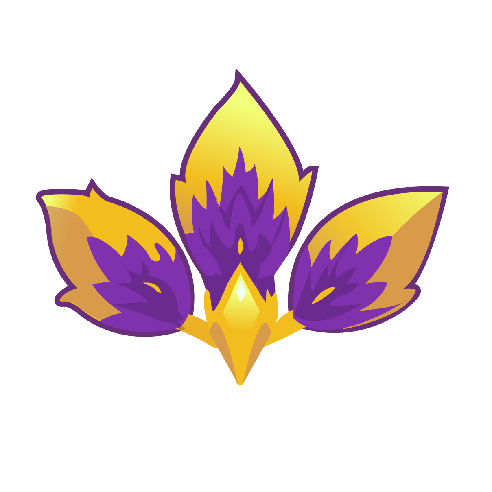

   

### Tópicos 

- [Descrição do projeto](#descrição-do-projeto)

- [Funcionalidades](#funcionalidades)

- [Aplicação](#aplicação)

- [Ferramentas utilizadas](#ferramentas-utilizadas)

- [Acesso ao projeto](#acesso-ao-projeto)

- [Abrir e rodar o projeto](#abrir-e-rodar-o-projeto)

- [Desenvolvedores](#desenvolvedores)

## Descrição do projeto 

O seguinte projeto trata-se do desenvolvimento de uma página web focada na divulgação e adesão de jogadores e integrantes para o time de desenvolvimento do jogo Anahí,
um jogo metroidvania centrado nas vivências e obstáculos enfrentados pelo público feminino usando de conceitos como machismo, sexismo, discriminação e preconceitos entre
vários outros problemas sociais atuais abordados no jogo para conscientizar o público alvo: jovens estudantes da rede pública de ensino de forma lúdica e didática, a fim de construir 
uma sociedade melhor para todos a partir da conscientização, e incentivo do pensamento crítico.

## Funcionalidades

:heavy_check_mark: `Introdução do jogo: ` espaço responsável pela visão geral do jogo, responsável por informações como objetivos do jogo, categoria, breve resumo da história e chamada para ação

:heavy_check_mark: `Lista de personagens:` Onde será possível acessar as informações sobre as personagens, como aparência, habilidades, história, características etc.

:heavy_check_mark: `Lista de mapas:` Galeria de fotos dos mapas desenvolvidos junto de uma breve descrição sobre cada um.

:heavy_check_mark: `Conceito do jogo:` Apresentação mais detalhada do universo do jogo.

:heavy_check_mark: `Estratégias e mecânicas` Apresentação de como funcionará as mecânicas do jogo e sua estratégia.

:heavy_check_mark: `Problemáticas sociais enfrentados:` Destaque dos problemas sociais que geraram a necessidade da proposta. 

:heavy_check_mark: `Lições educacionais e sociais:` Destaques dos ensinamentos e benefícios que o jogo pode oferecer para os jogadores e para a sociedade.

:heavy_check_mark: `Sobre o projeto:` Descrição do nosso projeto junto de seus objetivos.

:heavy_check_mark: `Sobre a equipe:` Apresentação da equipe e da rede COLMEIA.

:heavy_check_mark: `Processo seletivo:` seção destinada a recrutar novas integrantes para o projeto.

## Aplicação

-- adicione aqui um gif do site

  

###

## Ferramentas utilizadas

- Figma
- HTML
- CSS
- Javascript

###

## Acesso ao projeto

Você pode [acessar o código fonte do projeto](https://github.com/Jadmartins936/Anahi-landing-page)

## Desenvolvedores

| [ Jad ](https://github.com/Jadmartins936?tab=repositories) |  [ Clóvis Ribeiro Júnior](https://github.com/crovim)  |
| :---: | :---: 
